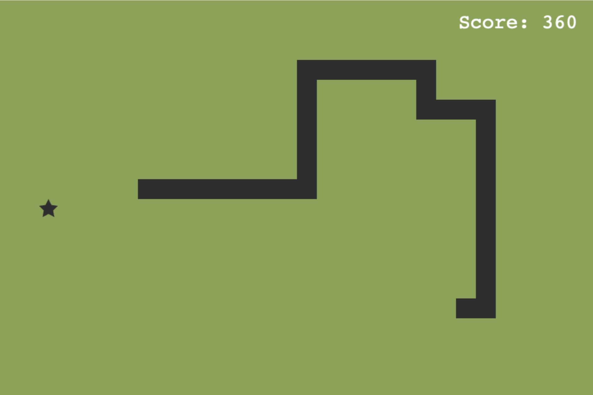
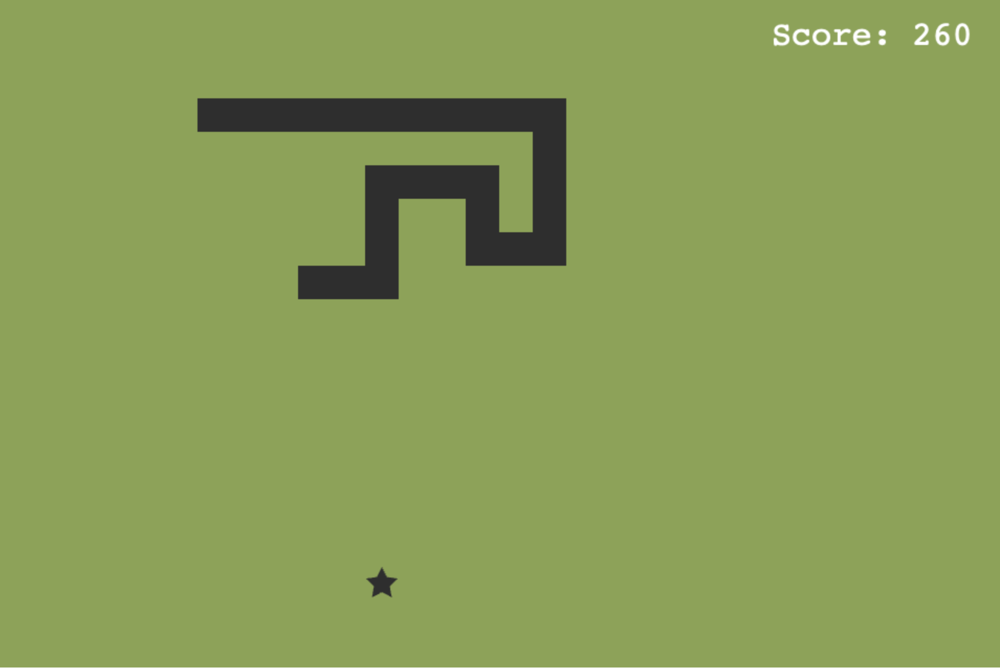
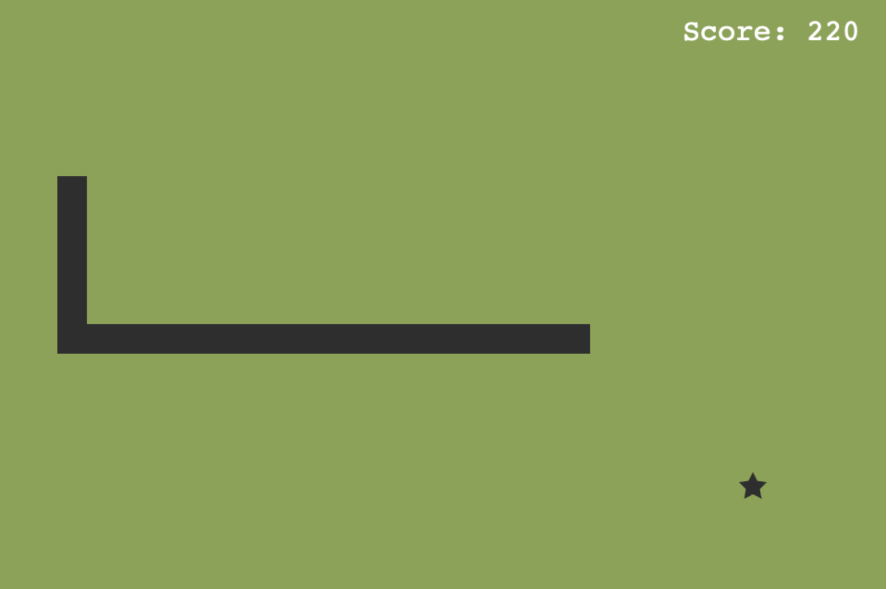

# 🐍 Snake — Introduction to Game Development [with Phaser]

This is the official code repository for the **"Introduction to Game Development"** workshop, hosted at the **Royal Institution**. In this course, we use the [Phaser](https://phaser.io/) JavaScript game engine to build a **classic Snake game** step-by-step.

This repository is structured to reflect the game development process through clearly defined branches. Each branch introduces a new concept or mechanic to help beginners build up a strong foundation in game development.

The workshop uses:
- [Phaser 3](https://phaser.io/phaser3)
- JavaScript (Ecmascript 2015)

>[!INFO]
>Live demo is available at [Github pages](https://st235.github.io/RoyalInstitution.IntroductionToGameDevelopment/).

## Workshop Goals

- Understand the basic structure of a Phaser project.
- Learn key game development concepts like 2d coordinates, scenes, game objects, movement, and collisions detection.

## Branch Structure

Each development milestone is stored as a separate **Git branch**:

| Branch | Description |
|--------|-------------|
| [`step/1/plain_scene`](https://github.com/st235/RoyalInstitution.IntroductionToGameDevelopment/tree/step/1/plain_scene) | Blank Phaser scene setup |
| [`step/2/static_snake_segment`](https://github.com/st235/RoyalInstitution.IntroductionToGameDevelopment/tree/step/2/static_snake_segment) | Display a static snake segment |
| [`step/3/implementing_grid`](https://github.com/st235/RoyalInstitution.IntroductionToGameDevelopment/tree/step/3/implementing_grid) | Add a grid system for movement |
| [`step/4/move_snake`](https://github.com/st235/RoyalInstitution.IntroductionToGameDevelopment/tree/step/4/move_snake) | Implement snake movement |
| [`step/5/generating_food`](https://github.com/st235/RoyalInstitution.IntroductionToGameDevelopment/tree/step/5/generating_food) | Randomly generate food items |
| [`step/6/collisions`](https://github.com/st235/RoyalInstitution.IntroductionToGameDevelopment/tree/step/6/collisions) | Add collision detection with self |
| [`step/7/display_score`](https://github.com/st235/RoyalInstitution.IntroductionToGameDevelopment/tree/step/7/display_score) | Show and update player score |

> [!NOTE]
> 💡 **To explore a specific version locally**, run:
> `git checkout step/X/branch_name`

## Results

| Gameplay #1 | Gameplay #2 | Gameplay #3 |
| ----- | ----- | ----- |
|  |  |  |

## Acknowledgements

This project is part of a series of **educational workshops by the [Royal Institution](https://www.rigb.org/)**, designed to introduce scientific concepts through practical, hands-on learning.

Special thanks to all participants and the open-source contributors behind [Phaser](https://phaser.io/).
